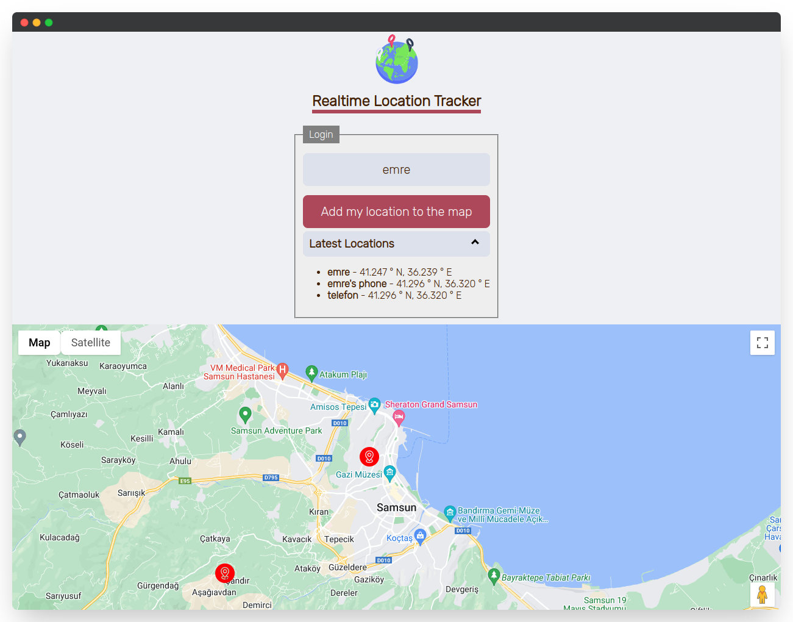

<h1 align="center"><br />Realtime Location Tracker</h1>

With the help of JavaScript, Firebase Realtime Database, and HTML Geolocation API, this application allows users to track their current location in real-time and displays it on a map. It provides a seamless user experience and helps individuals keep track of their location without any hassle.

## Features
- Show realtime locations
- Browser-based
- Marker info

## Usage
1. Go to [locationtracker.vercel.app](https://locationtracker.vercel.app) in any device.
2. Enter a nickname, and then click on the "Add my location to the map".
3. Track only those who have been online on the map in the last 10 seconds.

> **Don't forget!**
> to grant location permissions and enable location sharing.

## Screenshots


## Database Structure
```json
{
  "locations": {
    "emrecoban": {
      "label": "emrecoban",
      "latitude": 41.2477,
      "longitude": 36.2395,
      "timestamp": 1680825786101,
    },
    "emre's phone": {
      "label": "emre's phone",
      "latitude": 25.2467,
      "longitude": 63.4395,
      "timestamp": 1680825786101,
    }
  }
}
```

## Built with
- JavaScript
- Firebase Realtime Database
- HTML Geolocation API
- Google Maps API

## Support
- Sponsor to me on GitHub.
- Give a star to this repo.
- Follow me on Twitter [@emreshepherd](https://twitter.com/emreshepherd), or GitHub [@emrecoban](https://github.com/emrecoban).
- Buy me a coffee, or book: https://www.buymeacoffee.com/emrecoban

## References
- [HTML Geolocation API](https://www.w3schools.com/html/html5_geolocation.asp)
- [Google Maps JavaScript API](https://developers.google.com/maps/documentation/javascript)
- [Firebase Realtime Database](https://firebase.google.com/docs/database/web/start?hl=en#web-version-9)

## License
This project is available as open source under the terms of the [MIT License](https://github.com/emrecoban/realtimeLocationTracker/blob/main/LICENSE).